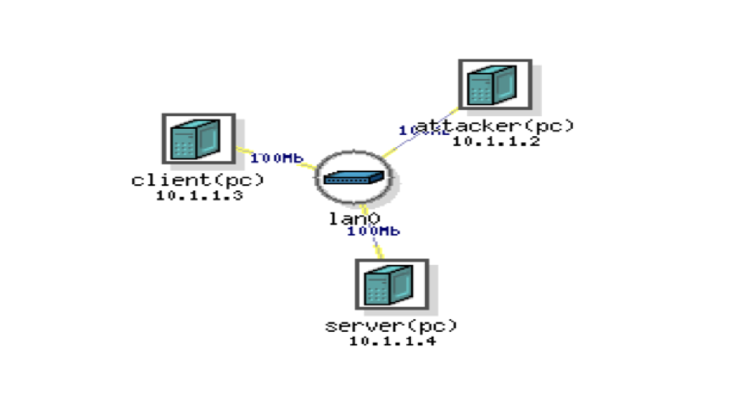

# Implementation_of_POSIX_Permission-Statefull_firewall

Implementing Portable OS interface(POSIX) Permission in stateful firewall to block particular attacks to an autonomous system for security.

# Topology

___________

### Project Details:

Wrote firewall script on linux systems using iptables to automate the process of filtering the tcp/udp/icmp packets like:

- *Ping flood attack.*
- *Stealth Scan.*
- *Xmas Scan.*
- *Ack Scan.*
- *Null Scan.*
- *Fin Scan.*

Also, used arptables to filter the arp packets caused due to arp spoof and MITM attack.

### Youtube Links:

- [To avoid Permisssions and Nmap](https://youtu.be/F907ZTBKplo) 
- [To overcome arpspoof attack](https://youtu.be/6QXVYntD3K8)

_______________

### Implementation:

- Install Kali Linux, metasploitable and ubuntu machine in Deterlab or VMware.
- The target hosts are metasploitable and ubuntu machine.
- The attacker is Kali Linux machine.
- Write the firewall.sh file with the iptables commands to filter the packets.
- Start the Wireshark, for monitoring the packet transfer.
- Finally, we can see all the packets causing the above attacks are blocked by the firewall created.
